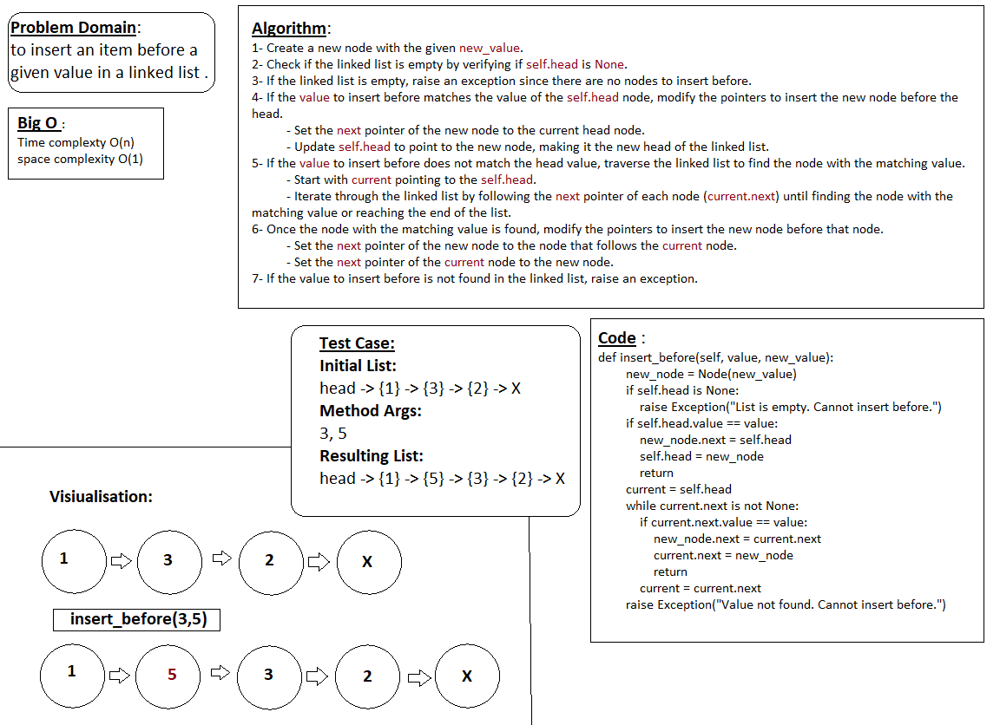

# Linked Lists in Python

Every Python programmer should know about linked lists:

They are among the simplest and most common data structures used in programming.

So, if you ever found yourself wondering, **“Does Python have a built-in or ‘native’ linked list data structure?”** or, **“How do I write a linked list in Python?”** then this tutorial will help you.

### What are the characteristics of a linked list?

A linked list is an ordered collection of values. Linked lists are similar to arrays in the sense that they contain objects in a linear order. However they [differ from arrays in their memory layout](https://dbader.org/blog/python-arrays).

**Arrays** are _contiguous_ data structures and they’re composed of fixed-size data records stored in adjoining blocks of memory. [In an array, data is tightly packed](https://dbader.org/blog/python-arrays)—and we know the size of each data record which allows us to quickly look up an element given its index in the array.

**Linked lists**, however, are made up of data records _linked_ together by pointers. This means that the data records that hold the actual “data payload” can be stored anywhere in memory—what creates the linear ordering is how each data record “points” to the next one.

There are two different kinds of linked lists: **singly-linked lists** and **doubly-linked lists**.

In a doubly-linked list, each element has a reference to both the _next and the previous_ element. Why is this useful? Having a reference to the previous element can speed up some operations, like removing \(“unlinking”\) an element from a list or traversing the list in reverse order.

* **Element Insertion & Removal**: Inserting and removing elements from a \(doubly\) linked list has time complexity _O\(1\)_, whereas doing the same on an array requires an _O\(n\)_ copy operation in the worst case. On a linked list we can simply “hook in” a new element anywhere we want by adjusting the pointers from one data record to the next. On an array we have to allocate a bigger storage area first and copy around the existing elements, leaving a blank space to insert the new element into.
* **Element Lookup**: Similarly, looking up an element given its index is a slow _O\(n\)_ time operation on a linked list—but a fast _O\(1\)_ lookup on an array. With a linked list we must jump from element to element and search the structure from the “head” of the list to find the index we want. But with an array we can calculate the exact address of an element in memory based on its index and the \(fixed\) size of each data record.
* **Memory Efficiency**: Because the data stored in arrays is tightly packed they’re generally more space-efficient than linked lists. This mostly applies to static arrays, however. [Dynamic arrays](https://en.wikipedia.org/wiki/Dynamic_array) typically over-allocate their backing store slightly to speed up element insertions in the average case, thus increasing the memory footprint.

here’s how you might implement **a class-based singly-linked list in Python**, including some of the standard algorithms:

```python
class ListNode:
    """
    A node in a singly-linked list.
    """
    def __init__(self, data=None, next=None):
        self.data = data
        self.next = next

    def __repr__(self):
        return repr(self.data)


class SinglyLinkedList:
    def __init__(self):
        """
        Create a new singly-linked list.
        Takes O(1) time.
        """
        self.head = None

    def __repr__(self):
        """
        Return a string representation of the list.
        Takes O(n) time.
        """
        nodes = []
        curr = self.head
        while curr:
            nodes.append(repr(curr))
            curr = curr.next
        return '[' + ', '.join(nodes) + ']'

    def prepend(self, data):
        """
        Insert a new element at the beginning of the list.
        Takes O(1) time.
        """
        self.head = ListNode(data=data, next=self.head)

    def append(self, data):
        """
        Insert a new element at the end of the list.
        Takes O(n) time.
        """
        if not self.head:
            self.head = ListNode(data=data)
            return
        curr = self.head
        while curr.next:
            curr = curr.next
        curr.next = ListNode(data=data)

    def find(self, key):
        """
        Search for the first element with `data` matching
        `key`. Return the element or `None` if not found.
        Takes O(n) time.
        """
        curr = self.head
        while curr and curr.data != key:
            curr = curr.next
        return curr  # Will be None if not found

    def remove(self, key):
        """
        Remove the first occurrence of `key` in the list.
        Takes O(n) time.
        """
        # Find the element and keep a
        # reference to the element preceding it
        curr = self.head
        prev = None
        while curr and curr.data != key:
            prev = curr
            curr = curr.next
        # Unlink it from the list
        if prev is None:
            self.head = curr.next
        elif curr:
            prev.next = curr.next
            curr.next = None

    def reverse(self):
        """
        Reverse the list in-place.
        Takes O(n) time.
        """
        curr = self.head
        prev_node = None
        next_node = None
        while curr:
            next_node = curr.next
            curr.next = prev_node
            prev_node = curr
            curr = next_node
        self.head = prev_node
```


---


### ✅ A Doubly-Linked List Class in Python

Let’s have a look at **how to implement a doubly-linked list in Python**. The following `DoublyLinkedList` class should point you in the right direction:

```python
class DListNode:
    """
    A node in a doubly-linked list.
    """
    def __init__(self, data=None, prev=None, next=None):
        self.data = data
        self.prev = prev
        self.next = next

    def __repr__(self):
        return repr(self.data)


class DoublyLinkedList:
    def __init__(self):
        """
        Create a new doubly linked list.
        Takes O(1) time.
        """
        self.head = None

    def __repr__(self):
        """
        Return a string representation of the list.
        Takes O(n) time.
        """
        nodes = []
        curr = self.head
        while curr:
            nodes.append(repr(curr))
            curr = curr.next
        return '[' + ', '.join(nodes) + ']'

    def prepend(self, data):
        """
        Insert a new element at the beginning of the list.
        Takes O(1) time.
        """
        new_head = DListNode(data=data, next=self.head)
        if self.head:
            self.head.prev = new_head
        self.head = new_head

    def append(self, data):
        """
        Insert a new element at the end of the list.
        Takes O(n) time.
        """
        if not self.head:
            self.head = DListNode(data=data)
            return
        curr = self.head
        while curr.next:
            curr = curr.next
        curr.next = DListNode(data=data, prev=curr)

    def find(self, key):
        """
        Search for the first element with `data` matching
        `key`. Return the element or `None` if not found.
        Takes O(n) time.
        """
        curr = self.head
        while curr and curr.data != key:
            curr = curr.next
        return curr  # Will be None if not found

    def remove_elem(self, node):
        """
        Unlink an element from the list.
        Takes O(1) time.
        """
        if node.prev:
            node.prev.next = node.next
        if node.next:
            node.next.prev = node.prev
        if node is self.head:
            self.head = node.next
        node.prev = None
        node.next = None

    def remove(self, key):
        """
        Remove the first occurrence of `key` in the list.
        Takes O(n) time.
        """
        elem = self.find(key)
        if not elem:
            return
        self.remove_elem(elem)

    def reverse(self):
        """
        Reverse the list in-place.
        Takes O(n) time.
        """
        curr = self.head
        prev_node = None
        while curr:
            prev_node = curr.prev
            curr.prev = curr.next
            curr.next = prev_node
            curr = curr.prev
        self.head = prev_node.prev
```

---

### append(new_value)
Adds a new node with the given new_value to the end of the linked list.

**Whiteboard**


**Arguments:**
- `new_value`: The value to be stored in the new node.

**Example:**
```python
my_list = LinkedList()
my_list.append(5)
my_list.append(10)
```
---


### insert_before(value, new_value)
Adds a new node with the given new_value immediately before the first node that has the value specified.

**Whiteboard**


**Arguments:**

- `value`: The value before which the new node should be inserted.
- `new_value`: The value to be stored in the new node.

**Example:**
```python
my_list = LinkedList()
my_list.append(1)
my_list.append(2)
my_list.append(3)
my_list.insert_before(2, 5)
```

---


### insert_after(value, new_value)
Adds a new node with the given new_value immediately after the first node that has the value specified.

**Whiteboard**


**Arguments:**

- `value`: The value after which the new node should be inserted.
- `new_value`: The value to be stored in the new node.

**Example:**
```python
my_list = LinkedList()
my_list.append(1)
my_list.append(2)
my_list.append(3)
my_list.insert_after(2, 5)
```

---


### kth element 


